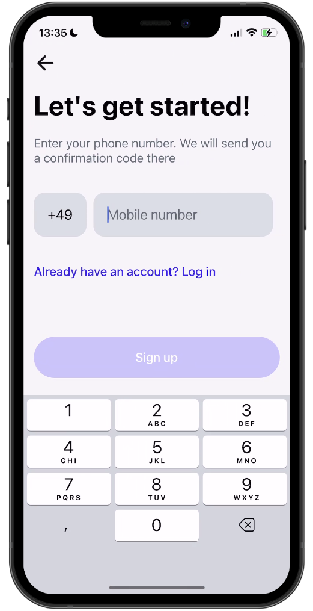

# React Native FinTech Clone with Clerk 🚀

**Platform**: iOS & Android (Cross-platform Mobile Application)  
**Technologies**: React Native, Expo Router, Zustand, MMKV, Tanstack Query, Reanimated, Victory Charts, Clerk, FaceID

This Fintech Clone application offers a high-performance, secure, and visually appealing experience, combining powerful state management and engaging user interactions. Built as a full-featured mobile app, it leverages Expo's file-based routing for a seamless user experience across iOS and Android.

## Features
- **🔐 Authentication with Clerk**: Seamless user authentication with OTP support.
- **📦 State Management**: Zustand and MMKV for fast and reliable state management.
- **💫 Drag-and-Drop Interactions**: Enhanced UX with Reanimated and Gestures.
- **🚀 API Routes with Expo Router**: Efficient data handling with API-based routing.
- **📈 Advanced Charts**: Data visualization with Victory Charts.
- **😎 FaceID Unlock**: Secure the app with FaceID or PIN Code.
- **🔀 Dynamic App Icon**: Customize the app’s icon dynamically.

---

## Screenshots

<div style="display: flex; flex-direction: 'row';">




</div>

## Demo

<div style="display: flex; flex-direction: 'row';">


</div>

## Prerequisites

Before starting, ensure you have the following:
- [Node.js](https://nodejs.org/) version 14.x or above
- [Expo CLI](https://docs.expo.dev/get-started/installation/) installed globally
- A [Clerk](https://clerk.dev/) account for authentication
- A `.env` file for sensitive configuration

## Environment Variables

Set up the following environment variables in a `.env` file:

```env
EXPO_PUBLIC_CLERK_FRONTEND_API=YOUR_CLERK_FRONTEND_API
EXPO_PUBLIC_CLERK_API_KEY=YOUR_CLERK_API_KEY
EXPO_PUBLIC_FACEID_SECRET=YOUR_FACEID_SECRET_KEY
EXPO_PUBLIC_VICTORY_CHARTS_API=YOUR_VICTORY_CHARTS_API_KEY
```
Note: Replace YOUR_CLERK_FRONTEND_API, YOUR_CLERK_API_KEY, YOUR_FACEID_SECRET_KEY, and YOUR_VICTORY_CHARTS_API_KEY with your actual keys.

## Installation and Execution
Clone the repository and install dependencies:
```
git clone https://github.com/username/FintechCloneApp.git
cd FintechCloneApp
npm install
cd ios
pod install
cd ..
```

## Compiling
You can compile your app locally with the run commands:
Build for IOS
```
npx expo run:ios
```
Build for Android
```
npx expo run:android
```
Build for physical device
```
npx expo run:ios --device
```

## Deployment

### 1. Deploying to GitHub
Initialize your local repository:
bash
Copier le code
```
git init
git add .
git commit -m "Initial commit"
git remote add origin https://github.com/username/FoodOrderingApp.git  //modify this link
git push -u origin main
```

### 2. Install the latest EAS CLI
EAS CLI is the command-line app that you will use to interact with EAS services from your terminal. To install it, run the command:
```
npm install -g eas-cli
```

### 3. Log in to your Expo account
If you are already signed in to an Expo account using Expo CLI, you can skip the steps described in this section. If you are not, run the following command to log in:
```
eas login
```
You can read the official information of this process by clicking on this link https://docs.expo.dev/tutorial/eas/ios-production-build/ or continue reading the information below

### 4. Run a build
After you have confirmed that you have a Google Play Store or Apple App Store account and decided whether or not EAS CLI should handle app signing credentials, you can proceed with the following set of commands to build for the platform's store:
```
eas build --platform android
```
Alternatively, you can use --platform all option to build for Android and iOS at the same time:
```
eas build --platform all
```

### 5. Deploy the build
If you have made it to this step, congratulations! Depending on which path you chose, you now either have a build that is ready to upload to an app store, or you have a build that you can install directly on an Android device/iOS Simulator.


